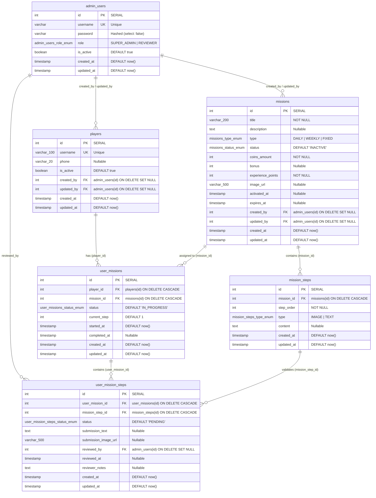

# Esquema de Base de Datos - LuckyBet Premios Backend

Este documento detalla el modelo entidad-relación (ER) de la base de datos PostgreSQL del backend, incluyendo diagramas en **Mermaid** listos para exportar/importar en **draw.io**, tablas de detalle, tipos enumerados (ENUMs), claves foráneas e índices.

---

## 1. Diagrama Entidad-Relación (Mermaid ERD)

> **Para importar en draw.io**:
> 1. Abre [draw.io / diagrams.net](https://app.diagrams.net/).
> 2. Menú superior: **Arrange** (Organizar) > **Insert** (Insertar) > **Advanced** (Avanzado) > **Mermaid**.
> 3. Pega el bloque de código que se encuentra a continuación y presiona **Insert**.



---

## 2. Tipos Enumerados (ENUMs)

| Tipo ENUM | Valores Posibles | Descripción |
| :--- | :--- | :--- |
| `admin_users_role_enum` | `SUPER_ADMIN`, `REVIEWER` | Roles administrativos del sistema |
| `missions_type_enum` | `DAILY`, `WEEKLY`, `FIXED` | Frecuencia/tipo de misión |
| `missions_status_enum` | `INACTIVE`, `ACTIVE`, `COMPLETED`, `CANCELLED` | Ciclo de vida de la misión |
| `mission_steps_type_enum` | `IMAGE`, `TEXT` | Tipo de evidencia solicitada en el paso |
| `user_missions_status_enum` | `IN_PROGRESS`, `COMPLETED`, `EXPIRED`, `CANCELLED` | Progreso del jugador en la misión |
| `user_mission_steps_status_enum` | `PENDING`, `APPROVED`, `REJECTED` | Estado de revisión de la entrega del paso |

---

## 3. Diccionario de Datos

### 3.1. `admin_users`
Usuarios con acceso al panel de administración y revisión.

| Campo | Tipo | Nulo | Default | Clave / Restricción | Descripción |
| :--- | :--- | :---: | :--- | :---: | :--- |
| `id` | `SERIAL` (`int`) | NO | Auto-incremental | **PK** | Identificador único |
| `username` | `varchar` | NO | | **UQ** | Nombre de usuario único |
| `password` | `varchar` | NO | | | Contraseña encriptada (bcrypt) |
| `role` | `admin_users_role_enum` | NO | | | Rol de administración (`SUPER_ADMIN`, `REVIEWER`) |
| `is_active` | `boolean` | NO | `true` | | Estado activo/inactivo |
| `created_at` | `TIMESTAMP` | NO | `now()` | | Fecha de creación |
| `updated_at` | `TIMESTAMP` | NO | `now()` | | Fecha de última actualización |

---

### 3.2. `players`
Jugadores / usuarios finales de la plataforma que realizan las misiones.

| Campo | Tipo | Nulo | Default | Clave / Restricción | Descripción |
| :--- | :--- | :---: | :--- | :---: | :--- |
| `id` | `SERIAL` (`int`) | NO | Auto-incremental | **PK** | Identificador único del jugador |
| `username` | `varchar(100)` | NO | | **UQ** | Nombre de usuario único del jugador |
| `phone` | `varchar(20)` | SÍ | `null` | | Teléfono de contacto |
| `is_active` | `boolean` | NO | `true` | | Estado activo/inactivo |
| `created_by` | `int` | SÍ | `null` | **FK** (`admin_users.id`) | Admin que registró al jugador (SET NULL al borrar) |
| `updated_by` | `int` | SÍ | `null` | **FK** (`admin_users.id`) | Admin que actualizó al jugador (SET NULL al borrar) |
| `created_at` | `TIMESTAMP` | NO | `now()` | | Fecha de creación |
| `updated_at` | `TIMESTAMP` | NO | `now()` | | Fecha de última actualización |

---

### 3.3. `missions`
Catálogo de misiones configuradas en el sistema.

| Campo | Tipo | Nulo | Default | Clave / Restricción | Descripción |
| :--- | :--- | :---: | :--- | :---: | :--- |
| `id` | `SERIAL` (`int`) | NO | Auto-incremental | **PK** | Identificador de la misión |
| `title` | `varchar(200)` | NO | | | Título descriptivo |
| `description` | `text` | SÍ | `null` | | Descripción detallada |
| `type` | `missions_type_enum` | NO | | | Tipo (`DAILY`, `WEEKLY`, `FIXED`) |
| `status` | `missions_status_enum` | NO | `'INACTIVE'` | | Estado (`INACTIVE`, `ACTIVE`, `COMPLETED`, `CANCELLED`) |
| `coins_amount` | `int` | NO | | | Monedas otorgadas como recompensa |
| `bonus` | `int` | SÍ | `null` | | Bonus adicional opcional |
| `experience_points` | `int` | NO | | | Puntos de experiencia otorgados |
| `image_url` | `varchar(500)` | SÍ | `null` | | Imagen de portada de la misión |
| `activated_at` | `TIMESTAMP` | SÍ | `null` | | Fecha de activación |
| `expires_at` | `TIMESTAMP` | SÍ | `null` | | Fecha de expiración |
| `created_by` | `int` | SÍ | `null` | **FK** (`admin_users.id`) | Creador de la misión |
| `updated_by` | `int` | SÍ | `null` | **FK** (`admin_users.id`) | Último admin en actualizar |
| `created_at` | `TIMESTAMP` | NO | `now()` | | Fecha de creación |
| `updated_at` | `TIMESTAMP` | NO | `now()` | | Fecha de última actualización |

---

### 3.4. `mission_steps`
Pasos o etapas requeridas para completar una misión.

| Campo | Tipo | Nulo | Default | Clave / Restricción | Descripción |
| :--- | :--- | :---: | :--- | :---: | :--- |
| `id` | `SERIAL` (`int`) | NO | Auto-incremental | **PK** | Identificador del paso |
| `mission_id` | `int` | NO | | **FK** (`missions.id`) | Misión a la que pertenece (CASCADE al borrar) |
| `step_order` | `int` | NO | | | Número de orden del paso |
| `type` | `mission_steps_type_enum` | NO | | | Tipo de requerimiento (`IMAGE`, `TEXT`) |
| `content` | `text` | SÍ | `null` | | Instrucción o contenido del paso |
| `created_at` | `TIMESTAMP` | NO | `now()` | | Fecha de creación |
| `updated_at` | `TIMESTAMP` | NO | `now()` | | Fecha de última actualización |

* **Índices únicos**: `IDX_bdc56231232e1ec51b3a3f7363` en `(mission_id, step_order)`

---

### 3.5. `user_missions`
Instancia de una misión tomada por un jugador.

| Campo | Tipo | Nulo | Default | Clave / Restricción | Descripción |
| :--- | :--- | :---: | :--- | :---: | :--- |
| `id` | `SERIAL` (`int`) | NO | Auto-incremental | **PK** | Identificador del registro |
| `player_id` | `int` | NO | | **FK** (`players.id`) | Jugador asociado (CASCADE al borrar) |
| `mission_id` | `int` | NO | | **FK** (`missions.id`) | Misión tomada (CASCADE al borrar) |
| `status` | `user_missions_status_enum` | NO | `'IN_PROGRESS'` | | Estado (`IN_PROGRESS`, `COMPLETED`, `EXPIRED`, `CANCELLED`) |
| `current_step` | `int` | NO | `1` | | Paso actual en el que se encuentra |
| `started_at` | `TIMESTAMP` | NO | `NOW()` | | Fecha de inicio |
| `completed_at` | `TIMESTAMP` | SÍ | `null` | | Fecha de finalización |
| `created_at` | `TIMESTAMP` | NO | `now()` | | Fecha de creación |
| `updated_at` | `TIMESTAMP` | NO | `now()` | | Fecha de última actualización |

---

### 3.6. `user_mission_steps`
Entrega y estado de revisión de cada paso individual realizado por un jugador.

| Campo | Tipo | Nulo | Default | Clave / Restricción | Descripción |
| :--- | :--- | :---: | :--- | :---: | :--- |
| `id` | `SERIAL` (`int`) | NO | Auto-incremental | **PK** | Identificador de la entrega |
| `user_mission_id` | `int` | NO | | **FK** (`user_missions.id`) | Misión del usuario (CASCADE al borrar) |
| `mission_step_id` | `int` | NO | | **FK** (`mission_steps.id`) | Paso de la plantilla (CASCADE al borrar) |
| `status` | `user_mission_steps_status_enum` | NO | `'PENDING'` | | Estado de revisión (`PENDING`, `APPROVED`, `REJECTED`) |
| `submission_text` | `text` | SÍ | `null` | | Texto enviado por el jugador |
| `submission_image_url` | `varchar(500)` | SÍ | `null` | | URL de la imagen enviada |
| `reviewed_by` | `int` | SÍ | `null` | **FK** (`admin_users.id`) | Admin que revisó (SET NULL al borrar) |
| `reviewed_at` | `TIMESTAMP` | SÍ | `null` | | Fecha y hora de revisión |
| `reviewer_notes` | `text` | SÍ | `null` | | Comentarios u observaciones del revisor |
| `created_at` | `TIMESTAMP` | NO | `now()` | | Fecha de creación |
| `updated_at` | `TIMESTAMP` | NO | `now()` | | Fecha de última actualización |

* **Índices únicos**: `IDX_82fae97c45fe22fe31c6f95d31` en `(user_mission_id, mission_step_id)`

---

## 4. Esquema SQL DDL Completo (Alternativa para importar en draw.io)

> En draw.io también puedes usar: **Arrange > Insert > Advanced > SQL** y pegar este DDL para generar el diagrama con cajas relacionales automáticamente.

```sql
CREATE TYPE "admin_users_role_enum" AS ENUM('SUPER_ADMIN', 'REVIEWER');
CREATE TYPE "missions_type_enum" AS ENUM('DAILY', 'WEEKLY', 'FIXED');
CREATE TYPE "missions_status_enum" AS ENUM('INACTIVE', 'ACTIVE', 'COMPLETED', 'CANCELLED');
CREATE TYPE "mission_steps_type_enum" AS ENUM('IMAGE', 'TEXT');
CREATE TYPE "user_missions_status_enum" AS ENUM('IN_PROGRESS', 'COMPLETED', 'EXPIRED', 'CANCELLED');
CREATE TYPE "user_mission_steps_status_enum" AS ENUM('PENDING', 'APPROVED', 'REJECTED');

CREATE TABLE "admin_users" (
    "id" SERIAL PRIMARY KEY,
    "username" VARCHAR(255) NOT NULL UNIQUE,
    "password" VARCHAR(255) NOT NULL,
    "role" admin_users_role_enum NOT NULL,
    "is_active" BOOLEAN NOT NULL DEFAULT true,
    "created_at" TIMESTAMP NOT NULL DEFAULT now(),
    "updated_at" TIMESTAMP NOT NULL DEFAULT now()
);

CREATE TABLE "players" (
    "id" SERIAL PRIMARY KEY,
    "username" VARCHAR(100) NOT NULL UNIQUE,
    "phone" VARCHAR(20),
    "is_active" BOOLEAN NOT NULL DEFAULT true,
    "created_by" INT REFERENCES "admin_users"("id") ON DELETE SET NULL,
    "updated_by" INT REFERENCES "admin_users"("id") ON DELETE SET NULL,
    "created_at" TIMESTAMP NOT NULL DEFAULT now(),
    "updated_at" TIMESTAMP NOT NULL DEFAULT now()
);

CREATE TABLE "missions" (
    "id" SERIAL PRIMARY KEY,
    "title" VARCHAR(200) NOT NULL,
    "description" TEXT,
    "type" missions_type_enum NOT NULL,
    "status" missions_status_enum NOT NULL DEFAULT 'INACTIVE',
    "coins_amount" INT NOT NULL,
    "bonus" INT,
    "experience_points" INT NOT NULL,
    "image_url" VARCHAR(500),
    "activated_at" TIMESTAMP,
    "expires_at" TIMESTAMP,
    "created_by" INT REFERENCES "admin_users"("id") ON DELETE SET NULL,
    "updated_by" INT REFERENCES "admin_users"("id") ON DELETE SET NULL,
    "created_at" TIMESTAMP NOT NULL DEFAULT now(),
    "updated_at" TIMESTAMP NOT NULL DEFAULT now()
);

CREATE TABLE "mission_steps" (
    "id" SERIAL PRIMARY KEY,
    "mission_id" INT NOT NULL REFERENCES "missions"("id") ON DELETE CASCADE,
    "step_order" INT NOT NULL,
    "type" mission_steps_type_enum NOT NULL,
    "content" TEXT,
    "created_at" TIMESTAMP NOT NULL DEFAULT now(),
    "updated_at" TIMESTAMP NOT NULL DEFAULT now(),
    CONSTRAINT "UQ_mission_step_order" UNIQUE ("mission_id", "step_order")
);

CREATE TABLE "user_missions" (
    "id" SERIAL PRIMARY KEY,
    "player_id" INT NOT NULL REFERENCES "players"("id") ON DELETE CASCADE,
    "mission_id" INT NOT NULL REFERENCES "missions"("id") ON DELETE CASCADE,
    "status" user_missions_status_enum NOT NULL DEFAULT 'IN_PROGRESS',
    "current_step" INT NOT NULL DEFAULT 1,
    "started_at" TIMESTAMP NOT NULL DEFAULT now(),
    "completed_at" TIMESTAMP,
    "created_at" TIMESTAMP NOT NULL DEFAULT now(),
    "updated_at" TIMESTAMP NOT NULL DEFAULT now()
);

CREATE TABLE "user_mission_steps" (
    "id" SERIAL PRIMARY KEY,
    "user_mission_id" INT NOT NULL REFERENCES "user_missions"("id") ON DELETE CASCADE,
    "mission_step_id" INT NOT NULL REFERENCES "mission_steps"("id") ON DELETE CASCADE,
    "status" user_mission_steps_status_enum NOT NULL DEFAULT 'PENDING',
    "submission_text" TEXT,
    "submission_image_url" VARCHAR(500),
    "reviewed_by" INT REFERENCES "admin_users"("id") ON DELETE SET NULL,
    "reviewed_at" TIMESTAMP,
    "reviewer_notes" TEXT,
    "created_at" TIMESTAMP NOT NULL DEFAULT now(),
    "updated_at" TIMESTAMP NOT NULL DEFAULT now(),
    CONSTRAINT "UQ_user_mission_step" UNIQUE ("user_mission_id", "mission_step_id")
);
```
