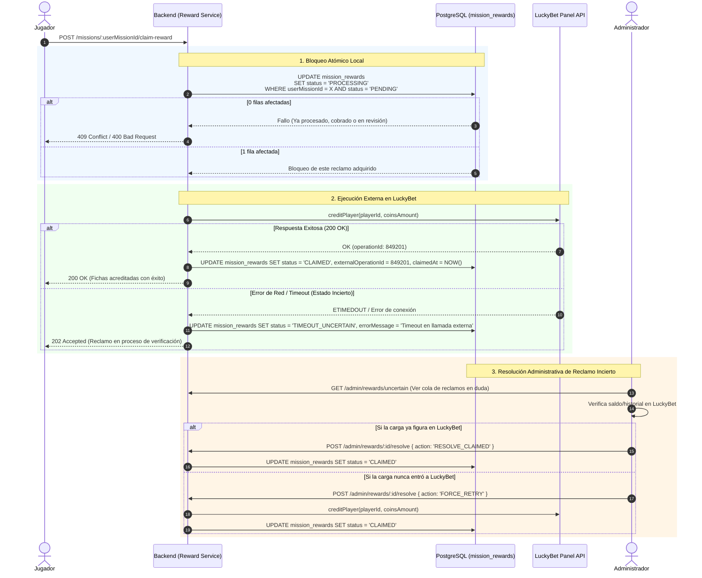
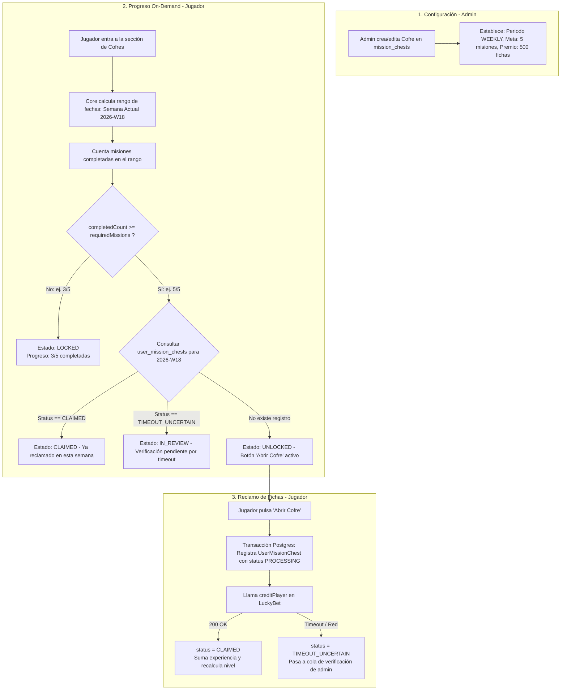

# Plan de Implementación: Refactorización de Misiones, Reclamo de Recompensas y Cofres

Este documento establece la hoja de ruta técnica y arquitectónica dividida en 3 fases modulares para robustecer el sistema de misiones, garantizar la seguridad en el acceso de jugadores, asegurar la acreditación de fichas/experiencia con manejo honesto de estados frente a la API de LuckyBet (caja negra sin identificador de transacción externo), y habilitar cofres dinámicos (semanales/mensuales).

---

## Fase 1: Refactorización de Misiones, Pasos Automáticos y Seguridad

### 1.1. Seguridad y Autorización de Jugadores (Fix Crítico)
- **Problema actual**: Los endpoints en `PlayerMisionesController` reciben `playerId` vía URL params (`/players/:playerId/...`) sin validar si el token de sesión pertenece realmente a dicho jugador. Además, es posible intentar avanzar o consultar pasos enviando un `userMissionId` ajeno.
- **Acciones**:
  1. Aplicar `@UseGuards(PlayerTokenGuard)` y `@CurrentToken()` / `@CurrentPlayer()` en `PlayerMisionesController`.
  2. Extraer el `playerId` directamente desde el contexto del token autenticado (`req.player.id`), eliminando el parámetro inseguro `:playerId` de las rutas o validando estricta coincidencia (`token.playerId === param.playerId`).
  3. Validar *ownership* (propiedad) en el Core: asegurar que el `userMissionId` pertenezca al `playerId` antes de permitir cualquier operación de envío (`submitStep`), verificación o consulta.
  4. Extraer el `adminId` real desde el contexto del token de administración en el endpoint de revisión (`reviewStep`), eliminando el ID hardcodeado.

### 1.2. Refactorización de Tipos de Pasos (`StepType`) y Pasos Automáticos
- **Extensión de Enums**:
  ```typescript
  export enum StepType {
    TEXT = 'TEXT',           // Manual: Respuesta en texto (requiere revisión admin)
    IMAGE = 'IMAGE',         // Manual: Captura de pantalla (requiere revisión admin)
    GAME_PLAY = 'GAME_PLAY', // Automático: Partidas/Juegos en LuckyBet (verificación determinista)
  }
  ```
- **Esquema de Configuración (`targetConfig` / `metadata`)**:
  - Agregar columna `targetConfig (jsonb, nullable)` en la entidad `MissionStep`.
  - Tipado para pasos `GAME_PLAY`:
    ```typescript
    export type GamePlayStepConfig = {
      provider?: string;       // Ej: "Pragmatic Play"
      gameId?: string;         // Ej: "vs20olympgate"
      minUniqueGames?: number; // Ej: 3 juegos distintos
    };
    ```
- **Lógica de Verificación Automática en `MisionesCore`**:
  - Implementar método `verifyAutoStep(userMissionId, stepId, playerId)`.
  - Conectar con `PanelApiCore.getLastPlayedGames(playerId, { provider, gameName, token })`.
  - Si cumple las condiciones: marcar `UserMissionStep` como `StepStatus.APPROVED` de forma inmediata (con `reviewedById = null` y fecha actual), avanzando el `currentStep` o completando la misión si era el último paso.
  - Si no cumple: retornar un error de negocio descriptivo indicando qué requisito falta.

### 1.3. Diagrama de Flujo: Validación y Ejecución de Pasos

```mermaid
flowchart TD
    A[Jugador envía paso / solicita verificación] --> B[PlayerTokenGuard valida autenticación]
    B --> C{¿El userMissionId pertenece al playerId?}
    C -->|No| D[Error 403 Forbidden: Acceso no autorizado]
    C -->|Sí| E{¿stepOrder === currentStep?}
    E -->|No| F[Error 400: Debe completar paso anterior]
    
    E -->|Sí| G{Tipo de Paso (StepType)}
    
    %% Flujo Manual
    G -->|TEXT / IMAGE| H[Valida Payload: Texto o Archivo de Imagen]
    H --> I[Guarda UserMissionStep con status: PENDING]
    I --> J[Aparece en Cola de Revisión de Admin]
    J --> K[Admin aprueba/rechaza vía reviewStep]
    
    %% Flujo Automático
    G -->|GAME_PLAY| L[Consulta PanelApiCore.getLastPlayedGames]
    L --> M{¿Cumple reglas de targetConfig?}
    M -->|No| N[Error 400: Aún no cumples los requisitos de juego]
    M -->|Sí| O[UserMissionStep pasa a status: APPROVED de inmediato]
    
    %% Cierre de Paso
    K -->|APPROVED| P{¿currentStep >= totalSteps?}
    O --> P
    
    P -->|No| Q[Incrementa currentStep = currentStep + 1]
    P -->|Sí| R[UserMission pasa a COMPLETED\nCrea registro PENDING en mission_rewards\nSuma experiencia en Postgres]
```

---

## Fase 2: Módulo de Recompensas y Reclamo Seguro (Reward Ledger)

### 2.1. Manejo de Estados ante la API Externa de LuckyBet (Caja Negra)
- **Problema real**: El panel PHP de LuckyBet no acepta referencias, metadatos ni claves de idempotencia. Si ocurre un timeout o corte de red durante la respuesta de `creditPlayer`, no se puede deducir con certeza matemática si la carga entró o no sin riesgo de falsos positivos frente a otras misiones con montos similares.
- **Estrategia de Aislamiento por Reclamo**:
  - Si falla **antes** de llamar a la API (error local en DB/validación): el estado queda en `PENDING` (seguro de reintentar por el usuario).
  - Si ocurre un **Timeout / Error de Red** durante la llamada: el estado de **esa recompensa específica** pasa a `TIMEOUT_UNCERTAIN` (Bloqueo solo de este reclamo, sin afectar otros reclamos o misiones del usuario).
  - La recompensa en `TIMEOUT_UNCERTAIN` pasa a una cola de auditoría para que un administrador confirme en un clic si se asentó en LuckyBet (`Marcar como Cobrada`) o si se debe forzar la emisión (`Reintentar Depósito`).

### 2.2. Estructura de la Tabla `mission_rewards`
- `id`: Primary Key autoincremental / UUID.
- `userMissionId`: Foreign Key a `UserMission` con restricción `UNIQUE`.
- `playerId`: ID del jugador beneficiario.
- `coinsAmount`: Cantidad de fichas a otorgar.
- `experiencePoints`: Puntos de experiencia otorgados (acreditados inmediatamente al completar la misión).
- `status`: Enum (`PENDING`, `PROCESSING`, `CLAIMED`, `TIMEOUT_UNCERTAIN`).
- `externalOperationId`: ID devuelto por LuckyBet si la respuesta fue exitosa (`200 OK`).
- `errorMessage`: Mensaje descriptivo si ocurrió un fallo o timeout.
- `claimedAt`: Fecha/hora del reclamo confirmado.

### 2.3. Diagrama de Secuencia: Reclamo y Manejo de Estados



---

## Fase 3: Módulo de Cofres Dinámicos (Metas Semanales / Mensuales)

### 3.1. Modelo de Datos (`MissionChest` y `UserMissionChest`)
- **Tabla `mission_chests` (Configuración de Administrador)**:
  - `id`: Identificador del cofre.
  - `title`: Título visible (ej: "Cofre Semanal de Oro").
  - `description`: Descripción de la meta.
  - `periodType`: Enum (`WEEKLY`, `MONTHLY`).
  - `requiredMissions`: Cantidad mínima de misiones completadas en el período (ej: 5).
  - `coinsAmount`: Fichas otorgadas al abrir el cofre.
  - `experiencePoints`: Experiencia otorgada.
  - `imageUrl`: Imagen del cofre en Storage.
  - `isActive`: Boolean para activar/desactivar el cofre.
- **Tabla `user_mission_chests` (Registro de Cobro)**:
  - `id`: Identificador del reclamo.
  - `playerId`: Jugador que reclama.
  - `chestId`: Cofre reclamado.
  - `periodKey`: Identificador único del período (ej: `"2026-W18"`, `"2026-05"`).
  - `completedMissionsCount`: Misiones computadas al momento del reclamo.
  - `status`: Enum (`PENDING`, `PROCESSING`, `CLAIMED`, `TIMEOUT_UNCERTAIN`).
  - `externalOperationId`: ID devuelto por LuckyBet al confirmar cobro.
  - `claimedAt`: Fecha de reclamo exitoso.
  - **Restricción Única**: `UNIQUE(playerId, chestId, periodKey)` para impedir aperturas duplicadas en el mismo período.

### 3.2. Lógica de Cálculo de Progreso (*Pull / On-Demand*)
- Sin procesos batch pesados (Cron-less):
  - Al consultar `GET /missions/chests`, el Core calcula el rango de fechas actual según `periodType` (Lunes 00:00 a Domingo 23:59 para semanal).
  - Cuenta las misiones completadas: `userMissionRepo.countCompletedBetween(playerId, startDate, endDate)`.
  - Evalúa si `completedCount >= chest.requiredMissions` y consulta si ya existe un registro en `user_mission_chests` para el `periodKey` actual.
  - Retorna el estado dinámico: `LOCKED (x/y)`, `UNLOCKED (listo para abrir)`, `CLAIMED (ya abierto)` o `IN_REVIEW (en verificación por timeout)`.

### 3.3. Diagrama de Flujo: Ciclo de Vida del Cofre Semanal



---

## 4. Matriz de Dependencias y Orden de Ejecución

```text
┌────────────────────────────────────────────────────────┐
│ Fase 1: Misiones Core, Seguridad y Pasos GAME_PLAY     │
└───────────────────────────┬────────────────────────────┘
                            │
                            ▼
┌────────────────────────────────────────────────────────┐
│ Fase 2: Reward Ledger (Reclamo Seguro y Estados Reales)│
└───────────────────────────┬────────────────────────────┘
                            │
                            ▼
┌────────────────────────────────────────────────────────┐
│ Fase 3: Módulo de Cofres Semanales y Mensuales         │
└────────────────────────────────────────────────────────┘
```
