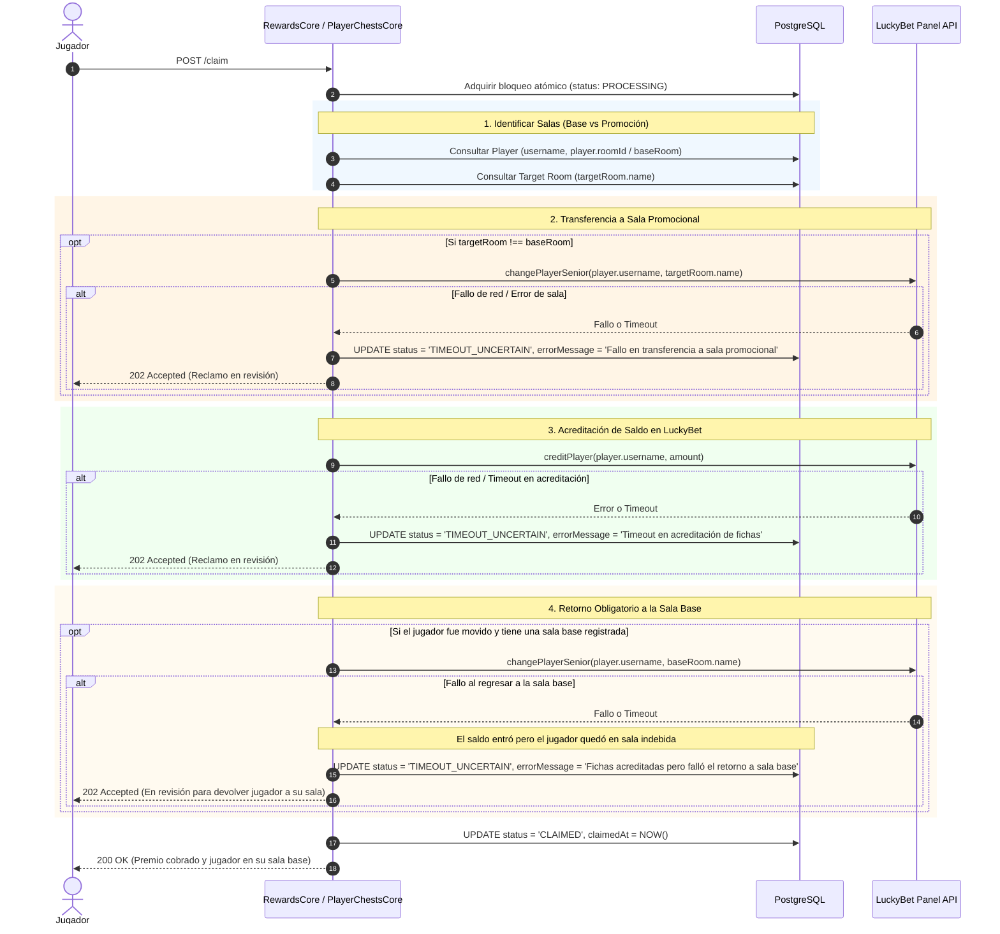

# Plan de Refactorización y Blindaje: Reclamo de Premios con Retorno de Sala, Zod Dates y Niveles

Este documento establece la arquitectura y el plan de implementación detallado para:
1. Blindar el flujo de reclamo de premios con **transferencia temporal y retorno obligatorio a la sala base** del jugador.
2. Manejar estados de fallo en transferencias de sala (`TIMEOUT_UNCERTAIN`).
3. Reemplazar `z.date()` por preprocesamiento compatible con Swagger y serialización JSON.
4. Desacoplar `BonusIntern` de `LevelsEntity` reemplazándolo por `roomId`, actualizando el nivel y la sala base del jugador al subir de nivel.

---

## 1. Lógica Blindada de Reclamación de Premios (Misiones y Cofres)

### Flujo Crítico de Ejecución:
Cuando un jugador reclama una recompensa (sea de misión o cofre) que tiene un `roomId` asignado (sala temporal de bonificación):



### Reglas Clave del Flujo:
1. **Fallo en Paso 2 (Transferencia a Sala Promocional)**:
   - Si no se pudo transferir al jugador a la sala con bono: **NO se emite `creditPlayer`**.
   - El reclamo pasa a `TIMEOUT_UNCERTAIN` para que el admin pueda verificar la sala o forzar el reintento.
2. **Fallo en Paso 3 (Acreditación de Fichas)**:
   - Pasa a `TIMEOUT_UNCERTAIN` con su bloqueo habitual.
3. **Fallo en Paso 4 (Retorno a Sala Base)**:
   - Si las fichas se cargaron pero el intento de devolver al usuario a su sala original falla: **la recompensa pasa a `TIMEOUT_UNCERTAIN`** indicando que el saldo fue acreditado pero el jugador quedó varado en la sala promocional.
   - El admin en un clic (`RESOLVE_CLAIMED`) devuelve al jugador a su sala base y marca como finalizado.

---

## 2. Corrección de Fechas en Schemas de Zod (`z.date()`)

- **Problema**: `z.date()` falla cuando Swagger o Fastify devuelven fechas como strings ISO (`2026-09-24T...`).
- **Solución**: Implementar helper universal de fechas:
  ```typescript
  export const zDateHelper = z.preprocess((val) => {
    if (val instanceof Date) return val;
    if (typeof val === 'string' || typeof val === 'number') {
      const d = new Date(val);
      return Number.isNaN(d.getTime()) ? undefined : d;
    }
    return val;
  }, z.date());
  ```
- **Aplicar en**:
  - `src/playerChests/app/dto/player-chest.schema.ts` (`claimedAt`).
  - `src/rewards/app/dto/reward.schema.ts` (`claimedAt`).
  - `src/rooms/app/dto/room.schema.ts` (`createdAt`, `updatedAt`).

---

## 3. Desacoplamiento de Bonos en Niveles (`src/levels`)

### 3.1. Entidad `LevelsEntity` (`src/levels/app/entities/levels.entity.ts`)
- Eliminar columna `bonus: BonusIntern`.
- Agregar columna `room_id` (`int, nullable: true`) con relación `@ManyToOne(() => BonusRoom, { nullable: true, onDelete: 'SET NULL' })`.

### 3.2. Schemas y DTOs (`src/levels/app/dto/level.schema.ts`)
- En `levelSchema`, `createLevelMultipartSchema`, `updateLevelMultipartSchema`, `levelFilterSchema`:
  - Reemplazar `bonus: z.enum(BonusIntern)` por `roomId: z.coerce.number().int().optional().nullable()`.
- Actualizar `LevelsEntityService` y `LevelsCore` para persistir `roomId`.

### 3.3. Transición de Nivel al Sumar Experiencia
- Crear helper en `PlayerRepoService`: `addExperienceAndRecalculateLevel(playerId: number, expPoints: number)`.
- Si la nueva experiencia hace que el jugador califique para un nivel superior:
  - Actualiza `player.levelId = newLevel.id`.
  - Si el nuevo nivel tiene asignado un `newLevel.roomId`:
    - Actualiza la sala base del jugador: `player.roomId = newLevel.roomId`.
    - Transfiere al jugador en LuckyBet a su nueva sala permanente: `panelApi.changePlayerSenior(player.username, room.name)`.
- Utilizar este método en `MisionesCore.completeUserMission` y `PlayerChestsCore.claimChest`.

---

## 4. Checklist y Fases de Ejecución

1. [ ] **Helper `zDateHelper`**: Crear en `src/shared/swagger/date.schema.ts` y reemplazar `z.date()` en `playerChests`, `rewards` y `rooms`.
2. [ ] **Desacoplar Niveles**:
   - Actualizar `LevelsEntity` (`bonus` -> `roomId`).
   - Actualizar `level.schema.ts`, `LevelsEntityService` y `LevelsCore`.
3. [ ] **Subida de Nivel y Sala Base en `PlayerRepoService`**:
   - Implementar recálculo de nivel con actualización de sala en PostgreSQL y LuckyBet.
4. [ ] **Blindar Reclamo en `RewardsCore` y `PlayerChestsCore`**:
   - Transferencia previa a sala promocional.
   - Acreditación de saldo.
   - Retorno obligatorio a sala base del jugador.
   - Si falla cualquier transferencia -> `TIMEOUT_UNCERTAIN`.
5. [ ] **Verificación de Calidad**:
   - `npm run build` (0 errores).
   - `npx biome lint src/` (0 errores).
   - `npm test` (100% de suites en verde).
